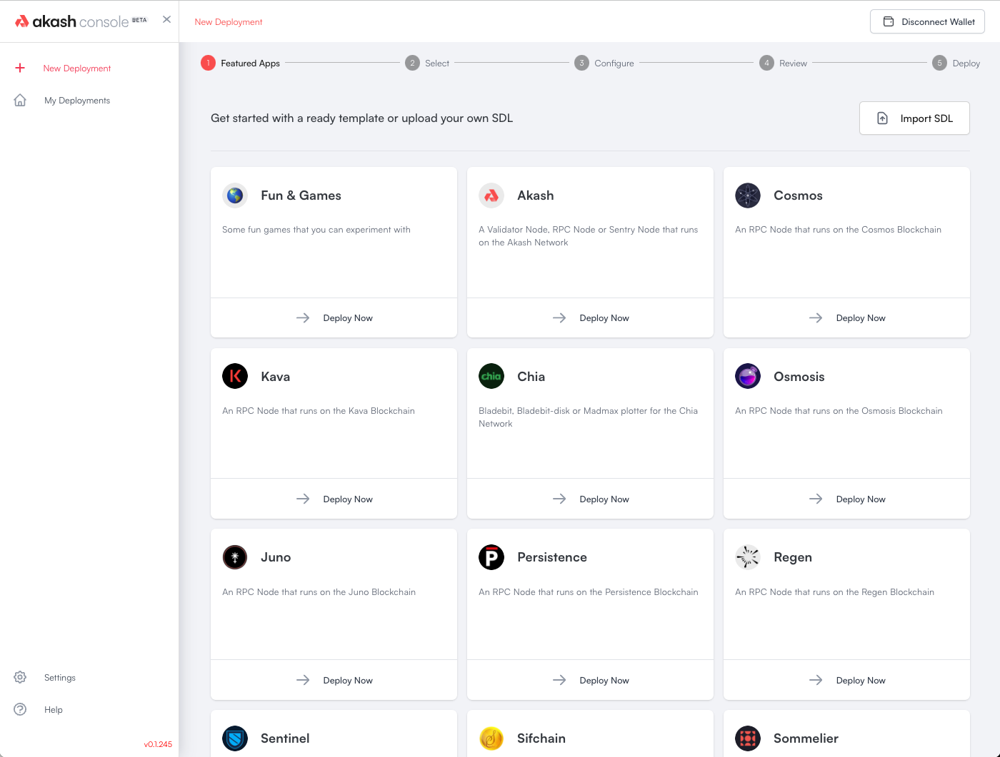

# Akash Console - Web UI deployment tool for Akash Network

Akash Console is an easy to use deployment tool for deploying workloads on to Akash Network providers. It is an alternative to the Command Line Interface (CLI). Akash Console can be run as a hosted service or locally (for development). Overclock Labs (creators of Akash Network) run an instance of Akash Console at https://console.akash.network/.

<p align="center">
  
</p>

## Contributing

If you would like to contribute to Akash Console, here are some ways to do so:

1. Beta test the [public facing app](https://console.akash.network/) and [report issues](https://github.com/akash-network/console/issues).
2. Read up on [Akash Console Strategy & Roadmap doc](strategy-roadmap.md)
3. Run it locally (instructions below) to get acquainted with the application.
4. Review the project board at https://github.com/orgs/akash-network/projects/2/ and comment on any issue that you wish to work on.
5. Join the [Akash Networks Clients SIG](https://github.com/akash-network/community/tree/main/sig-clients) meetings to learn about other issues or features you can help build.
6. Reach out to anil [at] akash.network to get access to our discord channel for Console OSS devs

NOTE: If you need AKT for deployment, share your Keplr wallet ID in the comment for the specific issue and we'll drop you 10AKT to test with (should let you test deploys 100s of times)

## Running it locally

Please ensure you have the below set of dependencies installed on your workstation:

* node 18+
* yarn (1.22.19)
* concurrently (7.2.2)
* craco (6.4.4)

You can install dependencies by running
```
npm install -g yarn concurrently craco
```
Then checkout, build and run Console
```
git clone https://github.com/akash-network/console.git
cd console
yarn install
yarn dev
```

https://user-images.githubusercontent.com/19495789/222617645-6b2daa48-6b41-4082-98a7-8f7b55ae295c.mp4


Note for MacOS

If you see errors regarding port 5000 being in use, this is due to AirPlay
using the port. You can disable this service in the MacOS Sharing settings.
